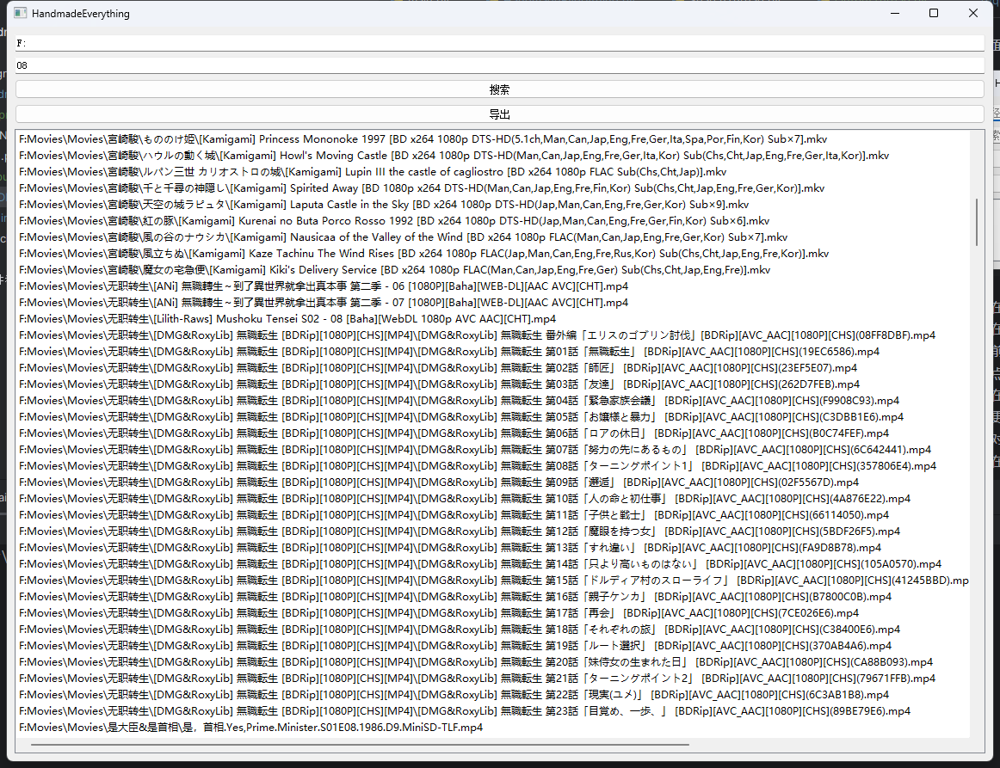

## handmade-everything
>尝试通过PyQt实现Everything软件
>
## 文件描述
- main.py 主函数，运行程序从这里进入
- HandmadeEverything.py 窗口类，包含对用户界面相关的代码
- SearchThread.py 搜索线程的类，包含文件搜索相关的代码

## 安装环境
1. Python->3.6.8
2. 提供了包列表requirements.txt，控制台运行 `pip install -r requirments.txt`安装环境

## 使用指南
主界面如图

1. 在路径栏输入目标文件的范围，最少应输入盘符
2. 在搜索内容栏输入目标文件的文件名，支持通过文件名的一部分搜索文件，目前仅支持搜索一个词语
3. 点击`搜索`，稍作等待
4. 在搜索按钮下方的白框显示结果，如果仍为白框，则表示未找到目标文件，请更换搜索内容
5. 对于搜索到的文件，双击可以用系统默认程序打开文件
6. 在搜索完成以后，可以点击`导出`,支持docx pdf md三种格式

运行结果如图

目前的文件量在10K以内都可以立刻搜索得到，并且不影响GUI的运行，
结果图所示F盘是日立机械硬盘（7200转），目前存储的文件已有500G，在这种情况下可以在1秒内得到结果

但是，如果把盘符指定为C盘，需要os.walk巨量文件的情况下，即使硬盘是nvme固态硬盘（970evo）GUI仍然会出现卡顿，
这可能是Python的GIL线程锁导致的。
在完成目前的TODO后，考虑通过更高级的方式避免GIL锁确保界面稳定运行不会卡顿，经过调研，
concurrent.futures库提供的线程池管理功能应当能优化

## 开发进度
### TODO
1. 同时匹配多个关键字
    - 正则表达式实现分隔多个关键字 search = re.split(r'\s+', text)
    - 搜索机制如何匹配多个关键字仍在探索
2. 使用NTFS的USN日志实现文件索引
    - 目前可以获取这个文件，但是如何处理仍在探索
3. 通过数据库存储文件索引，每次运行文件通过匹配更改更新数据库
4. 提供命令行调用功能

### DONE: 
1. 图形化界面
    - 通过PyQt5简单制作界面
2. 单个词语搜索
    - 通过os.walk实现的文件索引
3. 多线程搜索文件
    - 尝试threading库实现
    - 仅适用threading库造成了线程阻塞，包含GUI的主线程被阻塞了，
      没有实现多线程应有的搜索和显示独立运行的效果
    - 发现是在搜索线程中操作result_list导致的线程阻塞
      实际上搜索线程也在使用这一共享资源，尝试把搜索结果保存在列表里来避免阻塞
   - Qthread实现
    - 在display_search_results显示搜索结果
4. 提供导出为PDF、WORD文档的功能